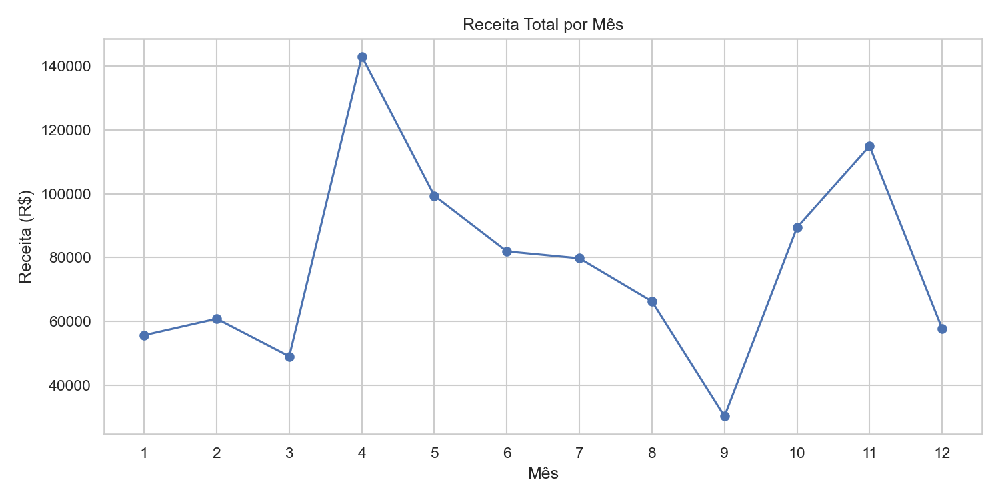
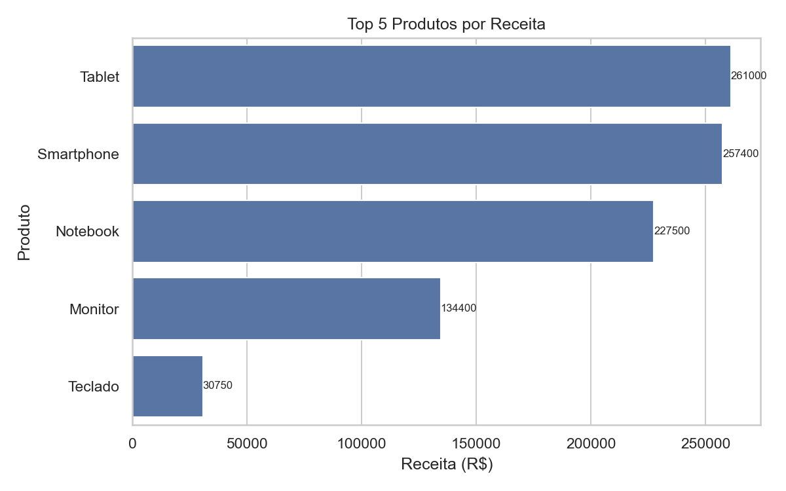
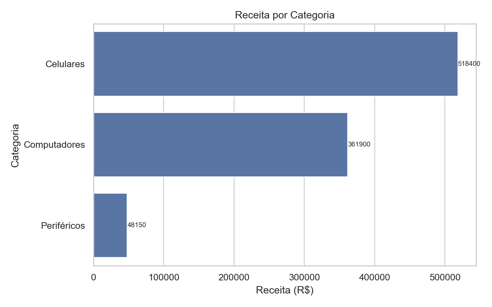
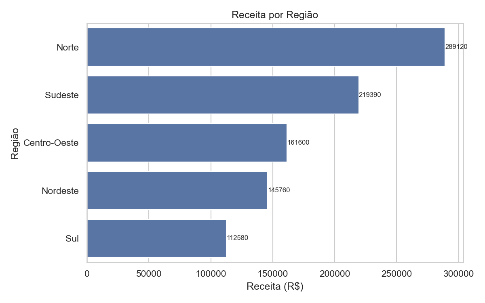
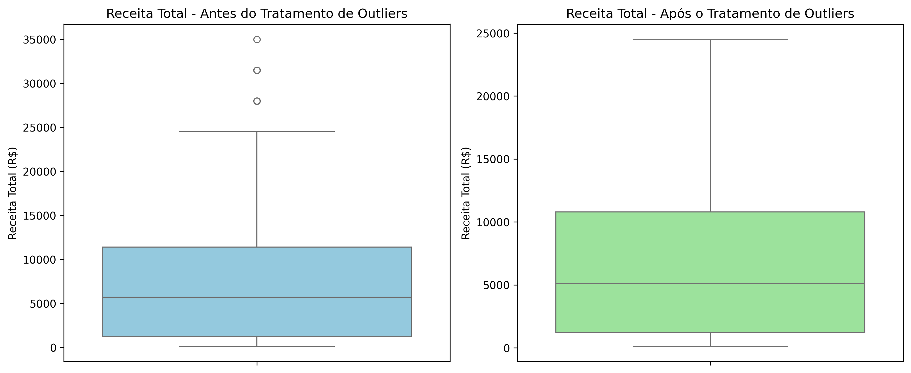

# 📊 DataView: Análise Exploratória e Preditiva de Vendas

## Sobre o Projeto

O **DataView** é um projeto de análise exploratória de dados (EDA) desenvolvido em Python, baseado em um pipeline completo de processamento de dados no formato ETL (Extract, Transform, Load).

O objetivo é simular um cenário real de varejo, onde dados são transformados em insights estratégicos para suporte à decisão.

---

# 🎯 Objetivos do Projeto

- Entender a evolução das vendas ao longo do tempo  
- Identificar produtos e categorias mais rentáveis  
- Avaliar desempenho regional  
- Analisar clientes mais valiosos  
- Investigar concentração de receita (Princípio de Pareto)  
- Avaliar impacto de outliers nas análises  

---

# 📦 O que o projeto analisa

✔ Receita por período  
✔ Produtos e categorias  
✔ Desempenho regional  
✔ Ticket médio  
✔ Segmentação de clientes  
✔ Estatísticas descritivas  
✔ Comparação entre dados com e sem outliers  
✔ Exportação de métricas e relatórios  

---

# 🧠 Conceitos Aplicados

- Manipulação de dados com Pandas  
- Operações numéricas com NumPy  
- Funções reutilizáveis  
- Função de ordem superior (pipeline com callbacks)  
- Estruturas condicionais e repetição  
- Engenharia de atributos  
- Tratamento de outliers (IQR)  
- Estatística descritiva  
- Visualização de dados  

---

# 📌 Dependências

Todas as dependências do projeto estão no arquivo:

```
requirements.txt
```

Instalação:

```bash
pip install -r requirements.txt
```

---

# 🚀 Como Executar

## 🟡 Google Colab

1. Faça upload do notebook `notebooks/01_analise_exploratoria_vendas.ipynb`  
2. Execute as células em ordem  

Se necessário:

```python
!pip install -r requirements.txt
```

---

## 🟢 Localmente (VS Code)

### 1. Clone o repositório

```bash
git clone <repo>
cd DataView
```

### 2. Instale as dependências

```bash
pip install -r requirements.txt
```

### 3. Execute o notebook

```
notebooks/01_analise_exploratoria_vendas.ipynb
```

---

# 🧪 Pipeline do Projeto

### RF01 — RF09
Etapas de geração, limpeza, transformação, análise e visualização dos dados.

### RF10 — Orquestração do Pipeline
Implementação de uma função de ordem superior (`executar_etapa`) que organiza e padroniza a execução de todas as etapas do pipeline.

### RF11 — Exportação de Dados
Geração automática de arquivos CSV, JSON e gráficos.

---

# 📈 Resultados do Pipeline

Após a execução completa do pipeline:

- 📄 Dataset bruto: **150 registros**
- 🧹 Dataset após limpeza (v1): **140 registros**
- 📉 Outliers removidos: **6 registros**
- ✅ Dataset final (v2): **134 registros**
- 📊 Gráficos exportados automaticamente
- 📁 Relatórios exportados em CSV e JSON

---

# 📁 Estrutura do Projeto

DataView/
│
├── data/
│   ├── raw/
│   │   └── vendas.csv
│   │
│   ├── processed/
│   │   ├── v1_com_outliers/
│   │   │   └── vendas_v1.csv
│   │   │
│   │   └── v2_outliers_tratado/
│   │       └── vendas_v2.csv
│   │
│   └── final/
│
├── notebooks/
│   └── 01_analise_exploratoria_vendas.ipynb
│
├── outputs/
│   ├── graficos/
│   │   ├── receita_por_mes.png
│   │   ├── receita_por_trimestre.png
│   │   ├── top_produtos.png
│   │   ├── receita_por_categoria.png
│   │   ├── receita_por_regiao.png
│   │   ├── distribuicao_receita.png
│   │   ├── segmentacao_clientes.png
│   │   └── boxplot_receita_outliers.png
│   │
│   ├── metricas_por_mes.csv
│   ├── segmentacao_clientes.csv
│   └── estatisticas_gerais.json
│
├── requirements.txt
├── LICENSE
└── README.md

---

# 📊 Resultados e Visualizações

---

## 📈 Receita ao longo do tempo

A análise mostra variação significativa nas vendas ao longo do período, com picos bem definidos em determinados meses.

<p align="center">
  
</p>

---

## 🏆 Produtos mais relevantes

Produtos como Tablets e Smartphones concentram grande parte da receita total.

<p align="center">
  
</p>

---

## 🧩 Categorias de maior impacto

A categoria **Celulares** domina o faturamento total do período analisado.

<p align="center">
  
</p>

---

## 🌎 Desempenho regional

A região **Norte** apresenta o maior volume de receita, enquanto outras regiões mostram distribuição mais equilibrada.

<p align="center">
  
</p>

---

## 📦 Outliers e distribuição

O tratamento de outliers reduz a dispersão dos dados sem alterar as principais tendências de negócio.

<p align="center">
  
</p>

---

# 📊 Principais Insights

- Forte variação de receita ao longo do tempo  
- Categoria Celulares lidera faturamento  
- Região Norte apresenta melhor desempenho  
- Forte concentração de receita em poucos clientes  
- Outliers influenciam significativamente a dispersão dos dados  

---

# 🔮 Melhorias Futuras

# 🔮 Melhorias Futuras

- Desenvolvimento de um dashboard interativo com Streamlit para exploração dinâmica dos dados.
- Implementação de modelos preditivos para estimativa de receita e vendas futuras.
- Segmentação automática de clientes utilizando técnicas de aprendizado não supervisionado (K-Means).
- Deploy da aplicação em ambiente de nuvem, permitindo acesso via navegador. 

---

# 📄 Licença

Este projeto está licenciado sob a Licença MIT.

---

# 👩‍💻 Autora

**Ananda Pires**

GitHub: https://github.com/ananda-pires